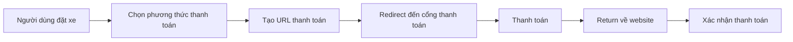

# 💳 API Thanh Toán Dịch Vụ Đưa Đón Sân Bay

## 📌 Tổng Quan

API tích hợp **4 cổng thanh toán thật** cho dịch vụ đưa đón sân bay:
- ✅ **VNPay** - Cổng thanh toán phổ biến nhất Việt Nam
- ✅ **MoMo** - Ví điện tử MoMo
- ✅ **ZaloPay** - Ví điện tử ZaloPay  
- ✅ **VietQR** - Thanh toán qua QR code ngân hàng

---

## 🚀 Endpoint API

### 1. Tạo URL Thanh Toán

**POST** `/api/airport-transfer-bookings/:bookingId/create-payment`

Tạo URL thanh toán cho đơn đặt xe đưa đón sân bay.

#### Request Body:
```json
{
  "phuongThuc": "VNPAY" | "MOMO" | "ZALOPAY" | "VIETQR"
}
```

#### Request Example:
```typescript
const response = await fetch('http://localhost:5000/api/airport-transfer-bookings/1/create-payment', {
  method: 'POST',
  headers: {
    'Content-Type': 'application/json',
  },
  body: JSON.stringify({
    phuongThuc: 'MOMO'
  })
});

const data = await response.json();
console.log(data.paymentUrl); // Redirect user to this URL
```

#### Response:
```json
{
  "success": true,
  "paymentUrl": "https://test-payment.momo.vn/...",
  "maGiaoDich": "TRANSFER17368597201231",
  "message": "Tạo URL thanh toán thành công"
}
```

---

## 🔧 Cấu Hình Environment Variables

### VNPay Configuration
```env
VNP_TMN_CODE=YOUR_TMN_CODE
VNP_HASH_SECRET=YOUR_HASH_SECRET
VNP_URL=https://sandbox.vnpayment.vn/paymentv2/vpcpay.html
VNP_RETURN_URL=http://localhost:3000/xac-nhan
```

### MoMo Configuration (Sandbox)
```env
MOMO_PARTNER_CODE=MOMO
MOMO_ACCESS_KEY=F8BBA842ECF85
MOMO_SECRET_KEY=K951B6PE1waDMi640xX08PD3vg6EkVlz
MOMO_API_URL=https://test-payment.momo.vn/v2/gateway/api/create
MOMO_REDIRECT_URL=http://localhost:5000/api/payments/momo-return
MOMO_IPN_URL=http://localhost:5000/api/payments/momo-ipn
```

### ZaloPay Configuration (Sandbox)
```env
ZALOPAY_APP_ID=2554
ZALOPAY_KEY1=sdngKKJmqEMzvh5QQcdD2A9XBSKUNaYn
ZALOPAY_KEY2=trMrHtvjo6myautxDUiAcYsVtaeQ8nhf
ZALOPAY_ENDPOINT=https://sb-openapi.zalopay.vn/v2/create
ZALOPAY_REDIRECT_URL=http://localhost:5000/api/payments/zalopay-return
```

### VietQR Configuration
```env
VIETQR_ACCOUNT_NO=0451000426932
VIETQR_ACCOUNT_NAME=TRAN HOAI BAO
VIETQR_ACQ_ID=970436
VIETQR_TEMPLATE=compact
```

---

## 💻 Frontend Integration Example

### React/Next.js Example

```typescript
'use client';

import { useState } from 'react';

export default function PaymentPage({ bookingId }: { bookingId: number }) {
  const [isLoading, setIsLoading] = useState(false);

  const handlePayment = async (method: 'VNPAY' | 'MOMO' | 'ZALOPAY' | 'VIETQR') => {
    setIsLoading(true);
    
    try {
      const response = await fetch(
        `http://localhost:5000/api/airport-transfer-bookings/${bookingId}/create-payment`,
        {
          method: 'POST',
          headers: {
            'Content-Type': 'application/json',
          },
          body: JSON.stringify({
            phuongThuc: method
          })
        }
      );

      const data = await response.json();

      if (data.success && data.paymentUrl) {
        // Redirect user to payment gateway
        window.location.href = data.paymentUrl;
      } else {
        alert('Không thể tạo thanh toán');
      }
    } catch (error) {
      console.error('Payment error:', error);
      alert('Lỗi khi tạo thanh toán');
    } finally {
      setIsLoading(false);
    }
  };

  return (
    <div className="payment-methods">
      <h2>Chọn phương thức thanh toán</h2>
      
      <button 
        onClick={() => handlePayment('VNPAY')}
        disabled={isLoading}
      >
        
        Thanh toán qua VNPay
      </button>

      <button 
        onClick={() => handlePayment('MOMO')}
        disabled={isLoading}
      >
        
        Thanh toán qua MoMo
      </button>

      <button 
        onClick={() => handlePayment('ZALOPAY')}
        disabled={isLoading}
      >
        
        Thanh toán qua ZaloPay
      </button>

      <button 
        onClick={() => handlePayment('VIETQR')}
        disabled={isLoading}
      >
        
        Thanh toán qua VietQR
      </button>
    </div>
  );
}
```

---

## 🔄 Payment Flow

### 1. User Flow


### 2. Technical Flow
1. **Frontend**: Gọi API `/create-payment` với `phuongThuc`
2. **Backend**: 
   - Lấy thông tin booking
   - Tạo mã giao dịch unique
   - Gọi API tương ứng (VNPay/MoMo/ZaloPay/VietQR)
   - Lưu payment record vào database
   - Return payment URL
3. **Frontend**: Redirect user đến payment URL
4. **Payment Gateway**: Xử lý thanh toán
5. **Return/IPN**: Cập nhật trạng thái thanh toán

---

## 📊 Database Schema

### Bảng `dat_dich_vu_dua_don`
```sql
CREATE TABLE `dat_dich_vu_dua_don` (
  `id` INT PRIMARY KEY AUTO_INCREMENT,
  `dichVuId` INT NOT NULL,
  `userId` INT NOT NULL,
  `loaiDichVu` VARCHAR(20) NOT NULL,
  `ngayDon` DATETIME(3) NOT NULL,
  `diemDon` VARCHAR(191) NOT NULL,
  `diemTra` VARCHAR(191) NOT NULL,
  `soHanhKhach` INT NOT NULL,
  `tongTien` DECIMAL(15,2) NOT NULL,
  `trangThaiThanhToan` VARCHAR(20) DEFAULT 'pending',
  `phuongThucThanhToan` VARCHAR(50),
  `trangThai` VARCHAR(20) DEFAULT 'pending',
  `createdAt` DATETIME(3) DEFAULT CURRENT_TIMESTAMP(3),
  `updatedAt` DATETIME(3) DEFAULT CURRENT_TIMESTAMP(3)
);
```

### Bảng `thanh_toan_dua_don`
```sql
CREATE TABLE `thanh_toan_dua_don` (
  `id` INT PRIMARY KEY AUTO_INCREMENT,
  `datDichVuId` INT NOT NULL,
  `soTien` DECIMAL(15,2) NOT NULL,
  `phuongThucThanhToan` VARCHAR(50) NOT NULL,
  `trangThai` VARCHAR(20) NOT NULL,
  `maGiaoDich` VARCHAR(100) UNIQUE,
  `thoiGianThanhToan` DATETIME(3),
  `createdAt` DATETIME(3) DEFAULT CURRENT_TIMESTAMP(3),
  FOREIGN KEY (`datDichVuId`) REFERENCES `dat_dich_vu_dua_don`(`id`)
);
```

---

## 🧪 Testing

### Tạo booking test:
```bash
POST http://localhost:5000/api/airport-transfer-bookings
Content-Type: application/json

{
  "dichVuId": 2,
  "userId": 2,
  "loaiDichVu": "mot_chieu",
  "ngayDon": "2026-01-15",
  "gioDon": "10:00",
  "diemDon": "Sân bay Tân Sơn Nhất",
  "diemTra": "Vinpearl Landmark 81",
  "soHanhKhach": 2,
  "tenKhachHang": "Trần Hoài Bảo",
  "soDienThoai": "0987654321",
  "email": "baohoaitran3112@gmail.com"
}
```

### Tạo thanh toán:
```bash
POST http://localhost:5000/api/airport-transfer-bookings/1/create-payment
Content-Type: application/json

{
  "phuongThuc": "MOMO"
}
```

---

## ⚠️ Lưu Ý Quan Trọng

1. **Sandbox vs Production**:
   - Hiện tại đang dùng môi trường **Sandbox/Test**
   - Để chuyển sang Production, cần đăng ký tài khoản doanh nghiệp với từng cổng thanh toán
   - Cập nhật credentials và endpoints trong `.env`

2. **Security**:
   - **KHÔNG BAO GIỜ** commit credentials vào git
   - Sử dụng `.env` file và thêm vào `.gitignore`
   - Validate signature từ payment gateway

3. **Return URLs**:
   - Cần deploy backend lên server public để nhận IPN/webhook
   - Localhost không nhận được IPN từ payment gateways

4. **Error Handling**:
   - Luôn kiểm tra signature từ payment gateway
   - Log tất cả payment transactions
   - Implement retry logic cho failed payments

---

## 📞 Support

- **VNPay**: https://sandbox.vnpayment.vn/apis
- **MoMo**: https://developers.momo.vn
- **ZaloPay**: https://docs.zalopay.vn
- **VietQR**: https://www.vietqr.io/

---

## ✅ Checklist Production

- [ ] Đăng ký tài khoản merchant với các cổng thanh toán
- [ ] Cập nhật credentials production vào `.env`
- [ ] Thay đổi endpoints từ sandbox sang production
- [ ] Deploy backend lên server public
- [ ] Cấu hình Return URL và IPN URL
- [ ] Test thanh toán thật với số tiền nhỏ
- [ ] Implement logging và monitoring
- [ ] Backup database định kỳ
